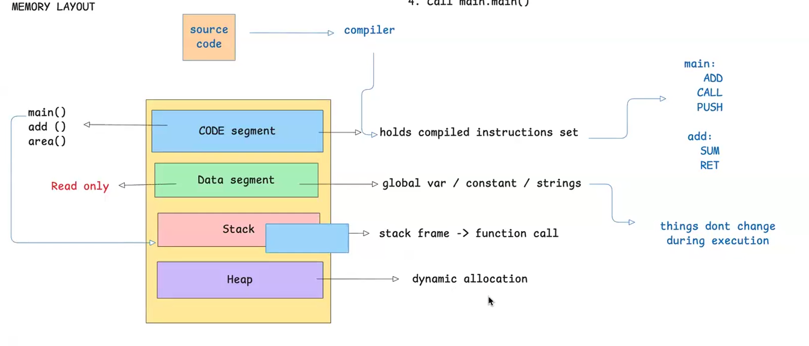
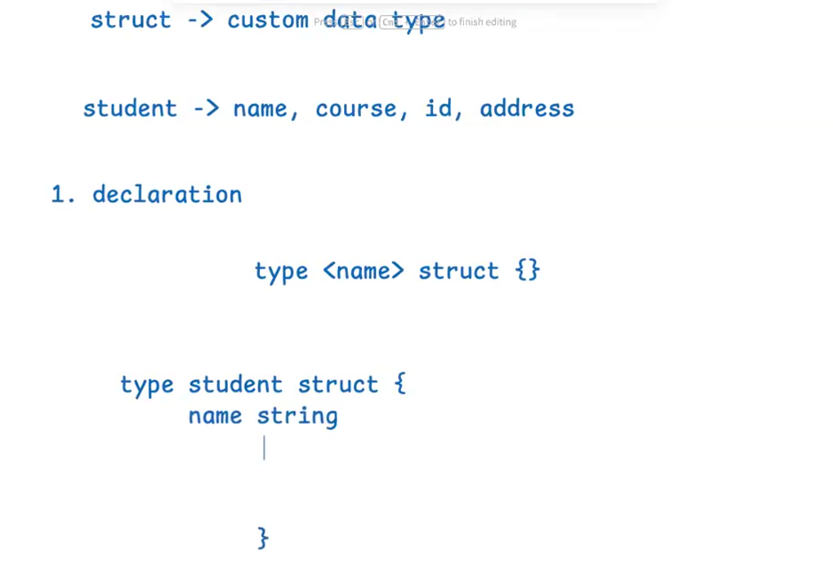

# Memory Layout Notes



## Big Picture

- Source code is compiled into machine instructions by the compiler.
- The compiled program is loaded into memory in separate regions.
- Common regions shown in the diagram are: code segment, data segment, stack, and heap.

## 1) Code Segment

- Contains compiled instructions (the executable code).
- Functions like `main()`, `add()`, and `area()` live here as instructions.
- This segment is read-only during execution.

## 2) Data Segment

- Stores global variables, constants, and static string data.
- Data here generally does not change structure during runtime.
- Also treated as read-only in many cases for constants/literals.

## 3) Stack

- Used for function call frames.
- Every function call creates a stack frame containing local state and return info.
- Stack memory is automatic and follows call order (LIFO).

## 4) Heap

- Used for dynamic memory allocation.
- Data can outlive a single function call.
- In Go, allocations on heap are managed by the garbage collector.

## Function Call Flow (as shown)

- `main` can call `add`.
- A function call pushes a new frame on the stack.
- Returning from the function pops that frame.

## Quick Comparison

- Code/Data segments: mostly fixed layout and stable during execution.
- Stack: short-lived function execution context.
- Heap: flexible, dynamically sized runtime allocations.

## Structs in Go



## What Is a Struct?

- A `struct` is a custom data type in Go.
- It groups related values (fields) into one unit.
- Example idea from the image: a `student` can have fields like `name`, `course`, `id`, and `address`.

## Declaration Syntax

```go
type <name> struct {}
```

## Example

```go
type student struct {
	name    string
	course  string
	id      int
	address string
}
```

## Key Point

- Use structs when several pieces of data belong together and represent one entity.
