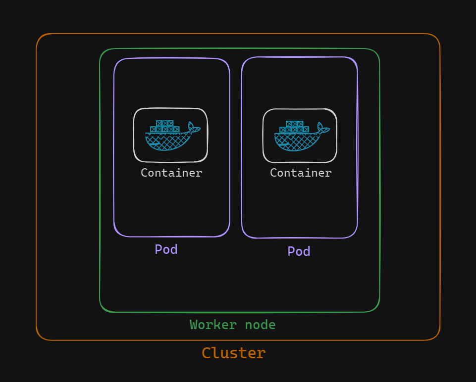
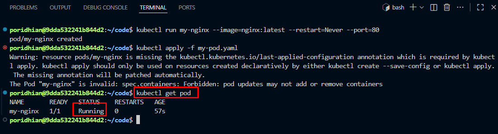
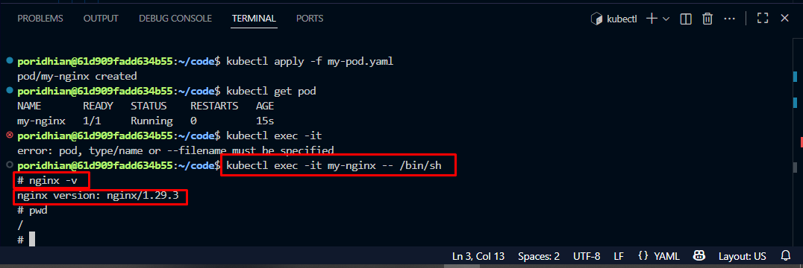

# Creating and Executing Commands in a Kubernetes Pod

A Pod is the smallest deployable unit in Kubernetes, a small "house" that holds one or more containers ("rooms"). Containers within the same Pod share the same network (they can reach each other over `localhost`), the same storage, and the same lifecycle, they start and stop together. You never deploy a container directly in Kubernetes, you always deploy a Pod.



A Pod sits inside a Worker Node, and a Cluster is made up of one or more Worker Nodes. Each Pod can wrap one or more containers, but in this lab we run a single-container Pod.

## Objectives

- Create a Pod running the `nginx:latest` image.
- Execute commands inside the Pod to interact with the running container.
- Verify that the command execution inside the Pod is successful.

## Step 1: Creating a Pod

Kubernetes gives you two ways to create resources:

- **Imperative approach**: create resources directly via a single command. Fast, good for testing or quick setup.
- **Declarative approach**: define resources in a YAML manifest and `apply` it. Preferred for production since the definition is versionable and reusable.

### Option 1: Imperative Approach

```bash
kubectl run my-nginx --image=nginx:latest --restart=Never --port=80
```

- `kubectl run` → create and run a workload.
- `my-nginx` → the Pod's name.
- `--image=nginx:latest` → run the NGINX web server, latest tag.
- `--restart=Never` → create a bare Pod, not a Deployment. This is the flag that matters: without it, `kubectl run` would wrap the container in a Deployment instead.
- `--port=80` → the container listens on port 80.

### Option 2: Declarative Approach

Create a YAML manifest (also saved at [`code/my-pod.yaml`](code/my-pod.yaml)):

```yaml
apiVersion: v1
kind: Pod
metadata:
  name: my-nginx
spec:
  containers:
  - name: nginx
    image: nginx:latest
    ports:
    - containerPort: 80
```

- `apiVersion: v1` → the Kubernetes API version Pod objects belong to.
- `kind: Pod` → the resource type being created.
- `metadata.name` → how this Pod will be referenced later (`kubectl get pod my-nginx`, `kubectl exec my-nginx`, ...).
- `spec.containers` → the actual container list: name, image, and exposed ports.

Apply it:

```bash
kubectl apply -f my-pod.yaml
```

Note: applying this manifest against a Pod that already exists from the imperative step above fails, `spec.containers` is immutable once a Pod is created, `kubectl apply` can't add or remove containers on a running Pod. A Pod named `my-nginx` has to be deleted first (`kubectl delete pod my-nginx`) before the declarative version can create it fresh.

## Step 2: Verifying the Pod

```bash
kubectl get pod
```



- **NAME**: the Pod's name (`my-nginx`).
- **READY**: ready containers over total containers, `1/1` means the one container in this Pod is ready.
- **STATUS**: `Running` once the Pod is active and healthy. Right after creation it may briefly show `ContainerCreating` while Kubernetes pulls the image and starts the container.
- **AGE**: how long the Pod has existed.

## Step 3: Executing Commands Inside the Pod

`kubectl exec` runs a command inside a running container, useful for debugging, inspecting logs, checking configuration, or just exploring the runtime environment. Open an interactive shell in the `my-nginx` Pod:

```bash
kubectl exec -it my-nginx -- /bin/sh
```

- `kubectl exec` → run a command inside a container.
- `-it` → interactive terminal session (`-i` keeps stdin open, `-t` allocates a TTY).
- `my-nginx` → the target Pod.
- `-- /bin/sh` → everything after `--` is the command to run inside the container, here it launches a shell.

Once inside, run standard Linux commands, e.g. check the NGINX version:

```bash
nginx -v
```



Further exploration from inside the shell:

- `ls` → list files, see the container's directory structure.
- `ps aux` → see what processes are running inside the container.
- `/etc/nginx/` → inspect NGINX's configuration files.

Exit back to the local terminal with:

```bash
exit
```

## Recap

A Pod was created two ways, imperatively with `kubectl run` and declaratively with `kubectl apply -f my-pod.yaml`, and `kubectl get pod` confirmed it reached `Running` status. `kubectl exec -it my-nginx -- /bin/sh` then opened a shell inside the container to run `nginx -v` and confirm NGINX was installed and reachable. The imperative vs. declarative distinction, and the ability to exec into a running container, apply to every Kubernetes resource, not just Pods, and are the two skills this whole track builds on next.
