# Docker Fundamentals from Kernel

This write-up follows the exact flow from class visuals and explains Docker from first principles: architecture, kernel relationship, container behavior, and daily commands.

## Part 1: What We Will Cover

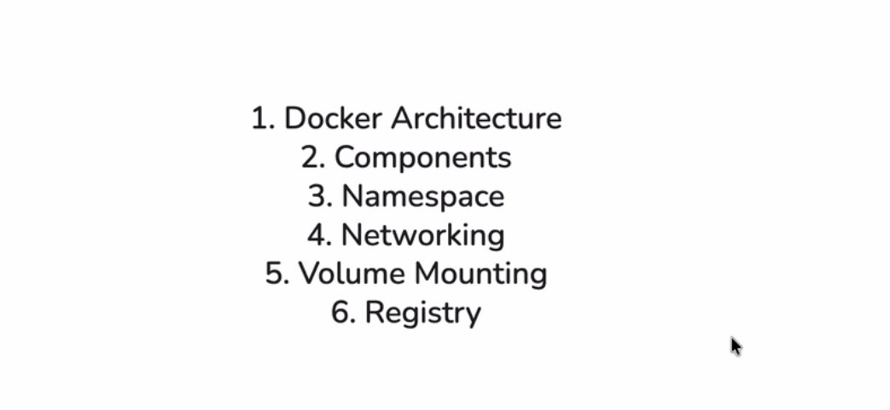

The session starts with a clear learning path:

1. Docker architecture
2. Components
3. Namespace
4. Networking
5. Volume mounting
6. Registry

Think of this as moving from foundation to production workflow.

## Part 2: DevOps and the CI/CD Bridge

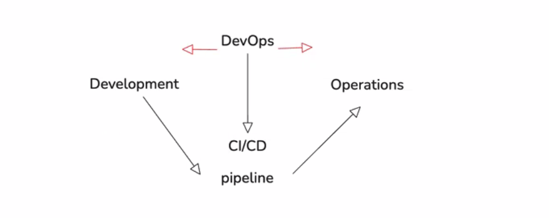

The diagram shows Development and Operations connected through DevOps, with CI/CD at the center. In practice, this means code should move through an automated pipeline instead of manual handoffs.

The goal is speed with stability: build fast, test early, release safely.

## Part 3: Why Isolation Matters

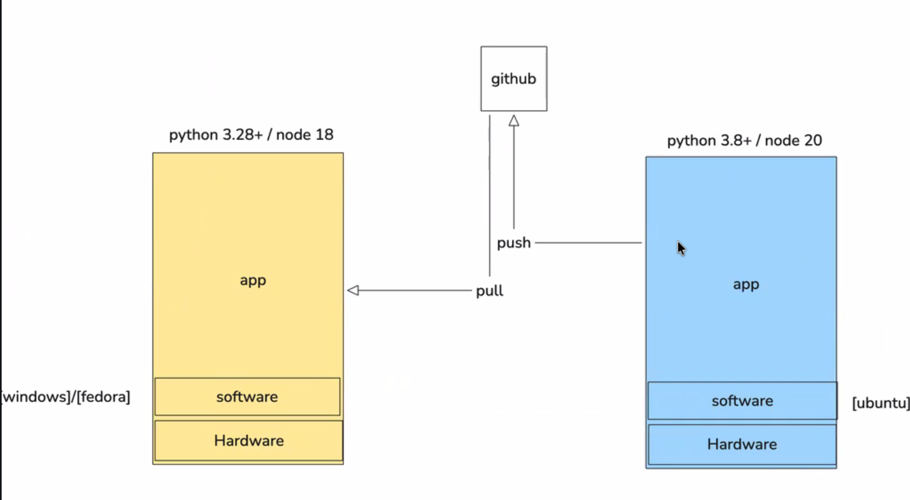

Each application needs its own runtime environment, network behavior, and storage expectations. Without isolation, apps can conflict with each other.

Containers solve this by giving each app its own isolated execution space while still running on the same host.

## Part 4: Portability Across Machines

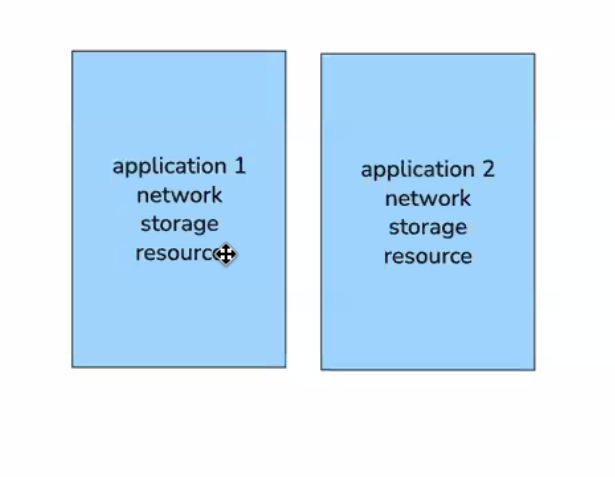

Different machines may have different versions of Python or Node.js. The diagram highlights push/pull flow via GitHub and the challenge of runtime mismatch.

Containers improve portability because the app runs with packaged dependencies, not just raw source code.

## Part 5: Operating System and Kernel Basics

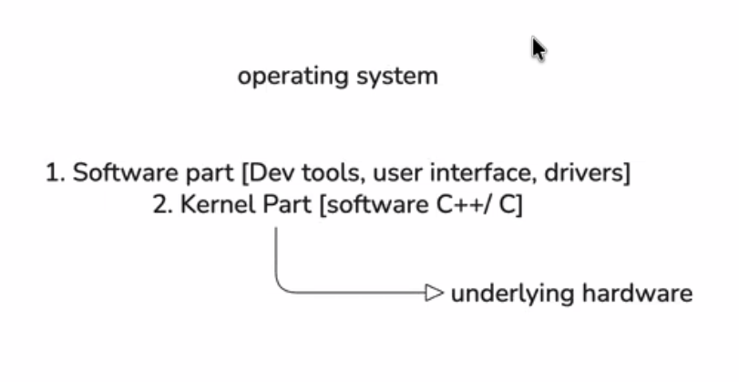

An OS has two broad sides:

- User-space/software layer: tools, UI, drivers, utilities
- Kernel layer: core system that talks to hardware

This kernel concept is key to understanding Docker, because containers share the host kernel.

## Part 6: Docker in the Host Stack

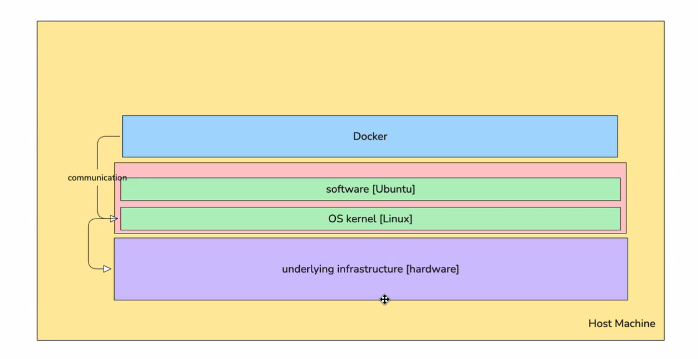

The host stack shown is:

1. Hardware/infrastructure
2. OS kernel (Linux)
3. Software/user-space (example: Ubuntu)
4. Docker

Docker sits above the host OS and orchestrates container execution.

## Part 7: One Container and Shared Host Resources

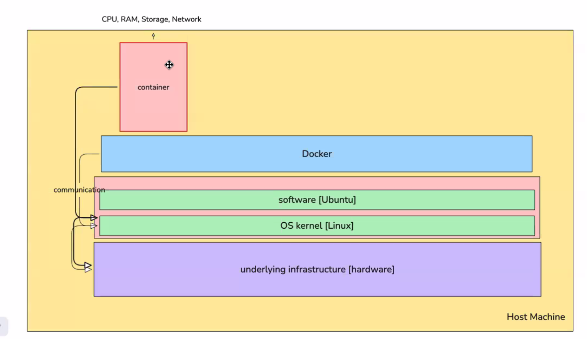

The container consumes host CPU, RAM, storage, and network through kernel-mediated access. It does not bring a separate full hardware stack.

Important idea: container efficiency comes from sharing host resources and kernel services.

## Part 8: Multiple Containers on One Host

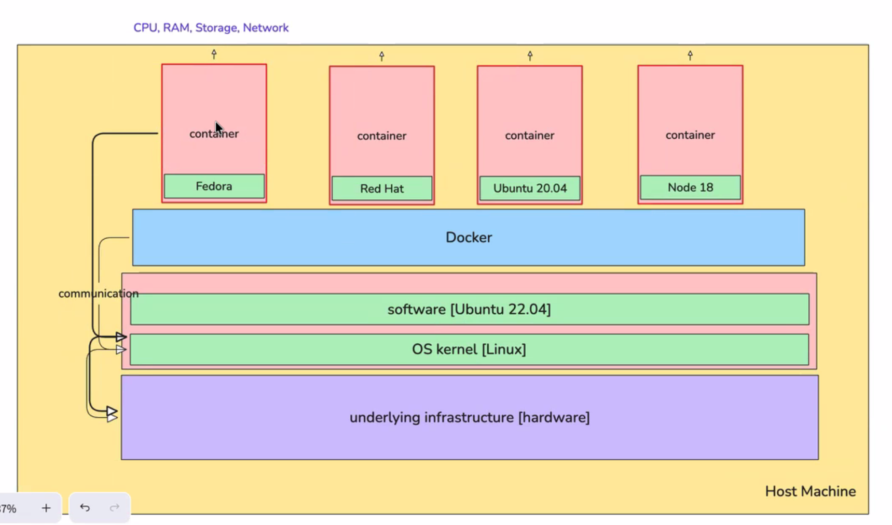
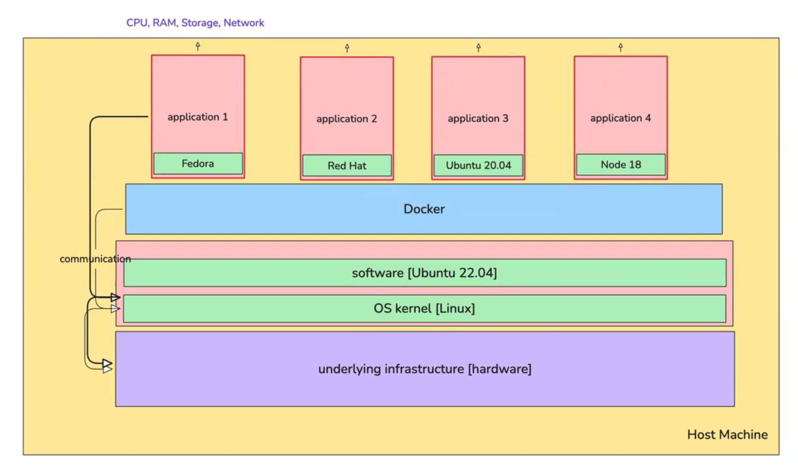

Many containers can run together on the same host. Each can carry different user-space dependencies (Fedora, Red Hat, Ubuntu 20.04, Node 18 in the examples) while the host continues using its own OS version.

This is why containers are powerful for microservices and mixed workloads.

## Part 9: VM vs Container

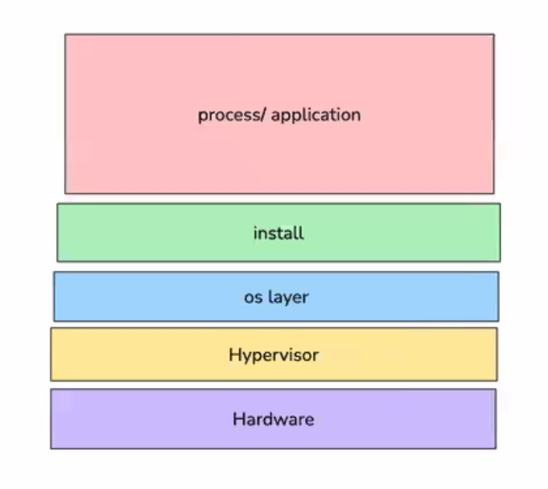
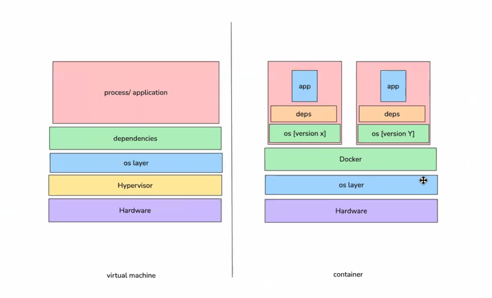

In a VM model, each workload includes a full guest OS above a hypervisor. In a container model, workloads share the host OS kernel through Docker.

Result:

- VMs: stronger isolation boundary, heavier footprint
- Containers: lighter and faster to start, ideal for app packaging and deployment

## Part 10: From Source Code to Running Container

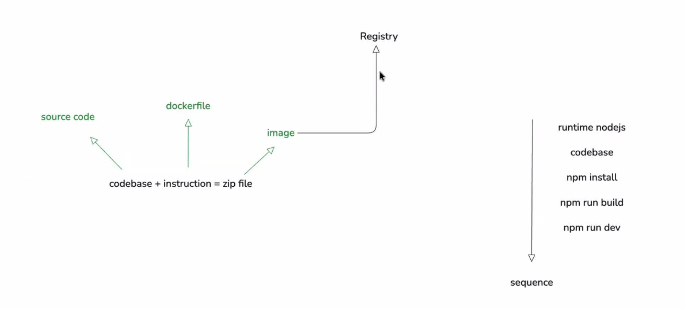
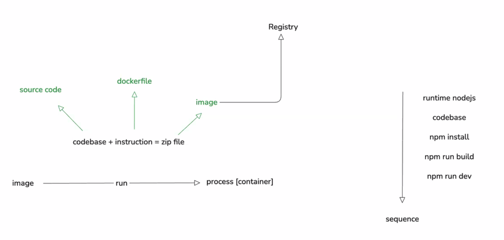

Lifecycle shown in the diagrams:

1. Source code + Dockerfile instructions
2. Build Docker image
3. Push image to registry
4. Pull image where needed
5. Run image as container process

Example sequence (Node.js):

1. Runtime setup
2. Add codebase
3. `npm install`
4. `npm run build`
5. `npm run dev`

## Part 11: Core Docker Commands to Remember

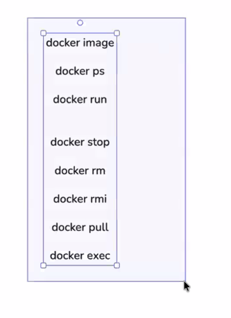

- `docker image` - manage images
- `docker ps` - list running/all containers
- `docker run` - create and start a container
- `docker stop` - stop a running container
- `docker rm` - remove container
- `docker rmi` - remove image
- `docker pull` - download image from registry
- `docker exec` - execute command inside a running container

These commands are enough to do most day-to-day container operations while learning.
