# Docker Networking

Docker containers can use different network modes depending on how isolated they should be and how they need to be reached from the host machine.

## 1. Host Network

<figure>
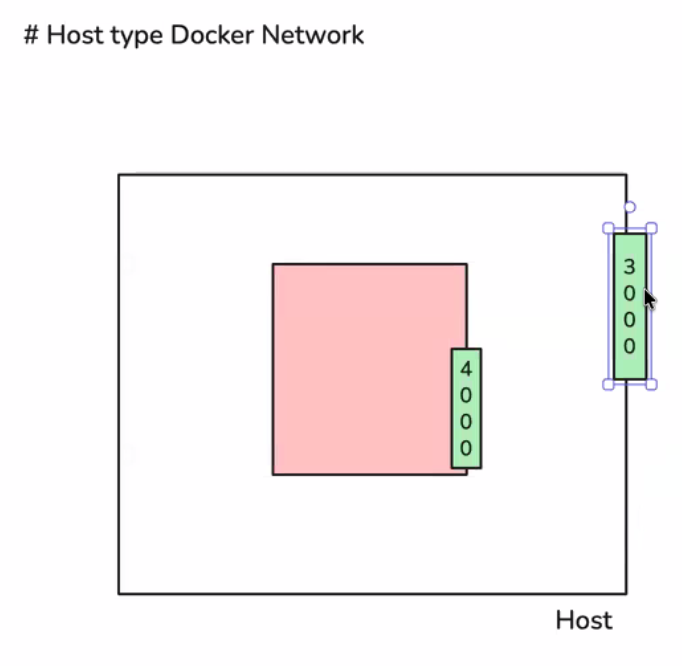
<figcaption>Host networking concept with the container sharing the host network stack.</figcaption>
</figure>

<figure>
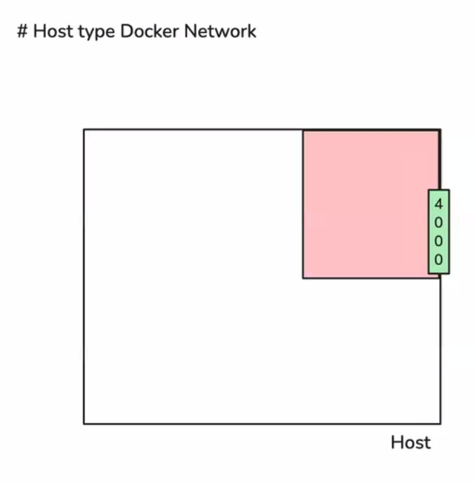
<figcaption>Host networking shown from a slightly different stage of the diagram.</figcaption>
</figure>

<figure>
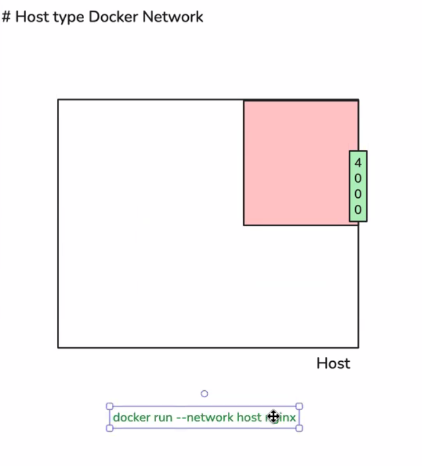
<figcaption>Host network example with the run command shown.</figcaption>
</figure>

<figure>
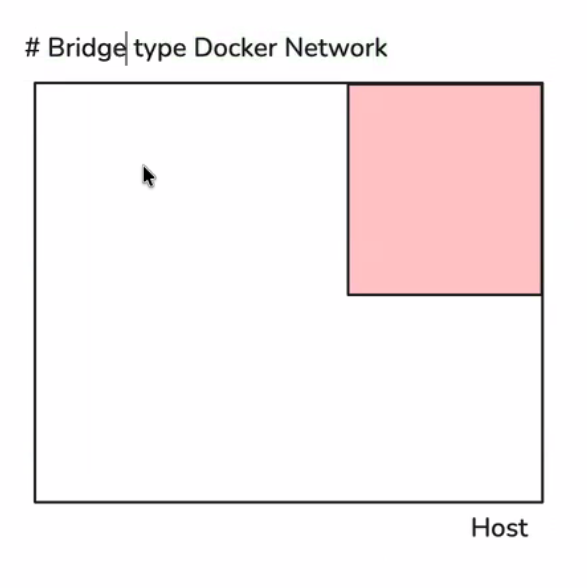
<figcaption>Host networking with port publishing contrast shown in the visual.</figcaption>
</figure>

In host mode, the container shares the host machine's network stack directly.

- The container does not get its own separate network namespace.
- There is no port mapping step because the container is already using the host network.
- If Nginx listens on port 80 inside the container, it is reachable on the host at port 80 as well.

Example:

```bash
docker run --network host nginx
```

Use host networking when you want the simplest and fastest networking path and you do not need isolation between host and container ports.

## 2. Bridge Network

<figure>
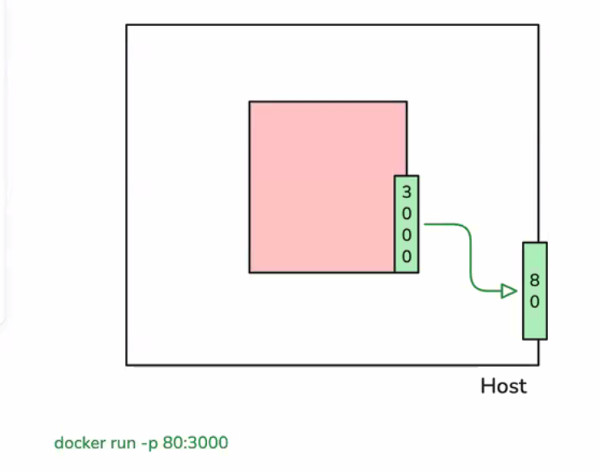
<figcaption>Bridge mode showing the container separated from the host.</figcaption>
</figure>

<figure>
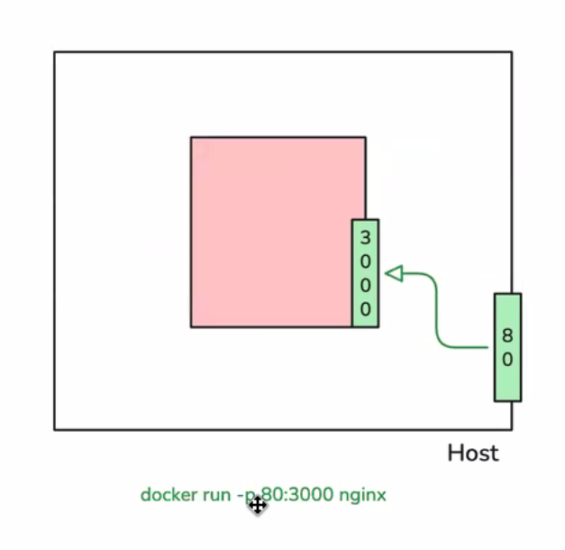
<figcaption>Bridge mode with the container and host ports shown.</figcaption>
</figure>

<figure>
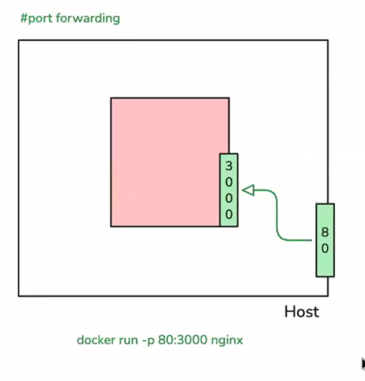
<figcaption>Port forwarding example for exposing a container service to the host.</figcaption>
</figure>

<figure>
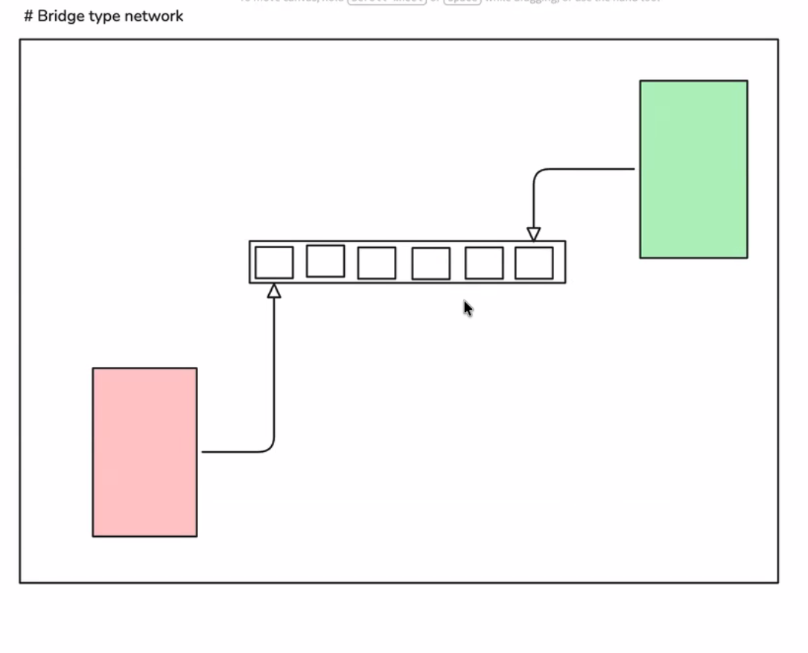
<figcaption>Bridge network layout showing container-to-bridge connections.</figcaption>
</figure>

<figure>
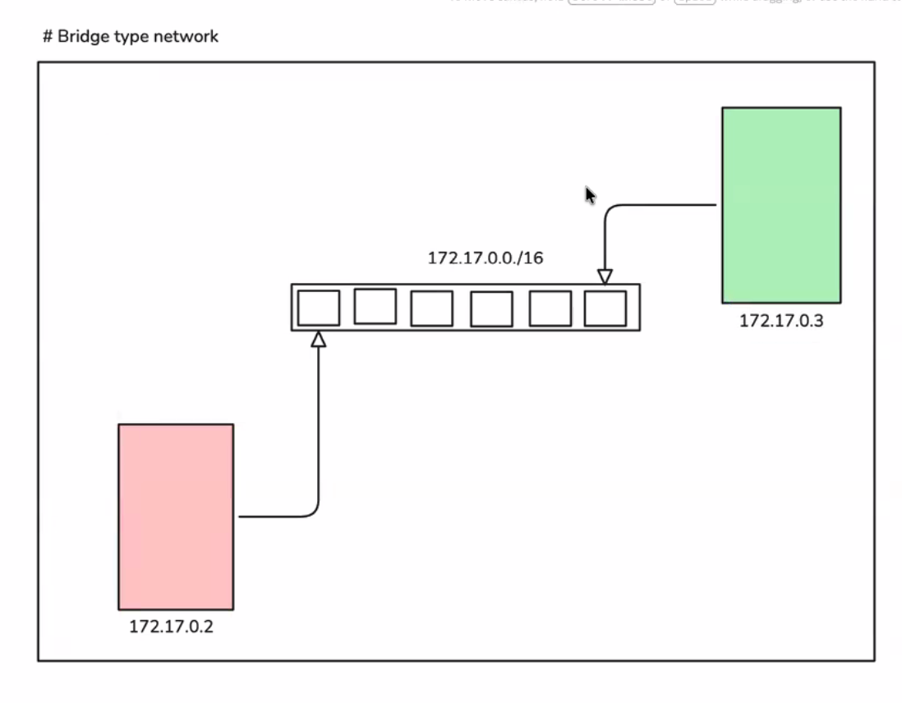
<figcaption>Bridge network with private IPs in the 172.17.0.0/16 range.</figcaption>
</figure>

Bridge mode is the default Docker networking model.

- Docker creates a virtual bridge on the host.
- Containers connected to the bridge receive private IP addresses, such as `172.17.0.2` and `172.17.0.3`.
- Containers can communicate through the bridge, but they are isolated from the host unless ports are published.
- The bridge network shown in the diagrams uses the subnet `172.17.0.0/16`.

Example:

```bash
docker run nginx
```

If you want the service to be reachable from the host, publish the container port:

```bash
docker run -p 80:3000 nginx
```

This maps host port `80` to container port `3000`.

## 3. Port Forwarding

Port forwarding is how a service inside a bridged container is exposed to the host.

The diagrams above show how traffic is sent from the host port into the container port.

- Traffic sent to the host port is forwarded into the container port.
- This is the normal way to access containerized web apps from the host browser.
- Without `-p`, the container stays reachable only inside Docker's internal network.

## 4. None Network

<figure>
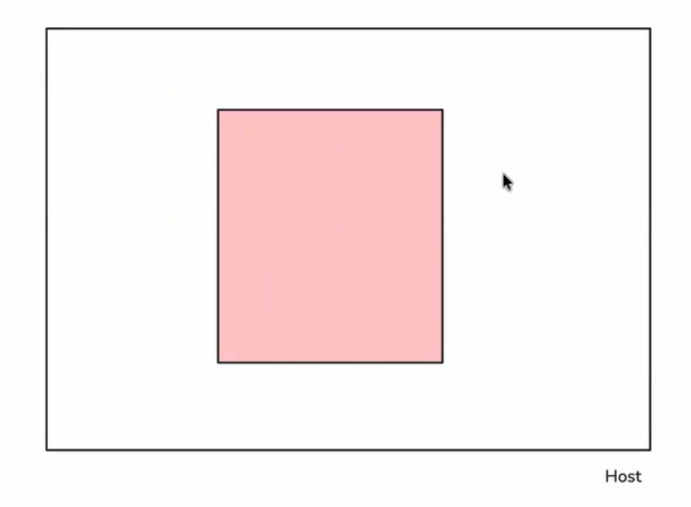
<figcaption>None network mode showing a fully isolated container.</figcaption>
</figure>

<figure>
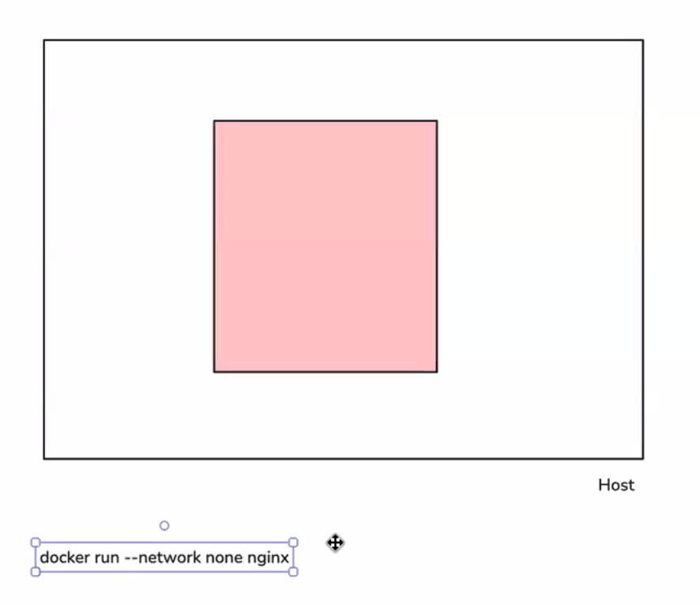
<figcaption>None network mode with the container exec command shown.</figcaption>
</figure>

<figure>
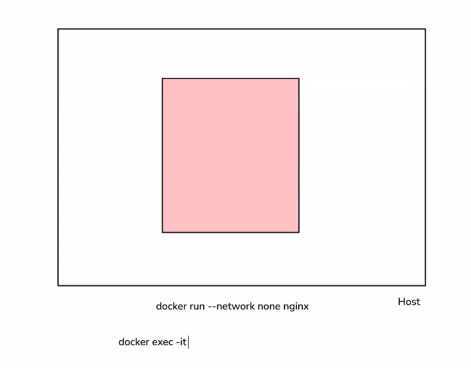
<figcaption>Isolated container state before entering it with docker exec.</figcaption>
</figure>

<figure>
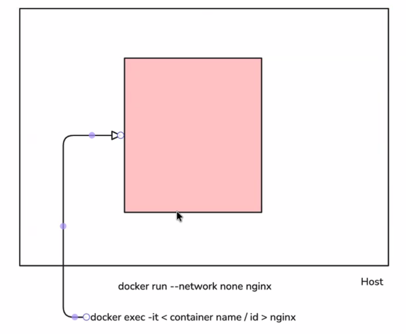
<figcaption>Container isolation with docker exec used to inspect the running container.</figcaption>
</figure>

<figure>
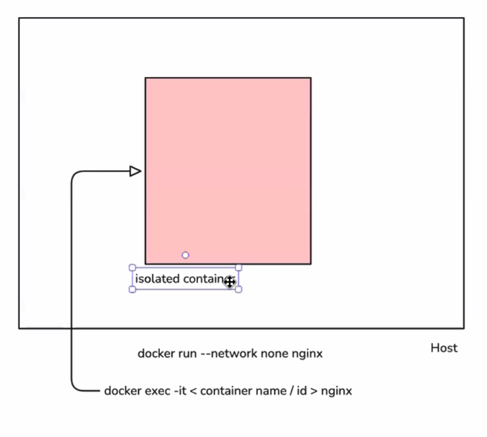
<figcaption>Final isolated-container view for none network mode.</figcaption>
</figure>

The `none` network mode gives the container no external network connectivity.

- The container gets an isolated network namespace.
- It cannot reach the host or other containers through normal networking.
- This is useful when you want complete network isolation.

Example:

```bash
docker run --network none nginx
```

You can still inspect a running container by entering it with `docker exec` if needed:

```bash
docker exec -it <container-name-or-id> sh
```

## 5. Quick Comparison

- Host: shares the host network directly.
- Bridge: default mode, uses Docker-managed private networking.
- None: isolated network namespace with no external access.

## 6. What The Diagrams Show

- The host diagrams show the container using the host network without port publishing.
- The bridge diagrams show containers connected through Docker's bridge network with private IPs.
- The forwarding example shows host port `80` mapping into container port `3000`.
- The none diagrams show an isolated container that does not participate in external networking.

## Summary Diagram

<figure>
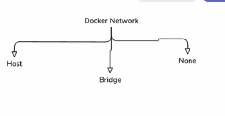
<figcaption>High-level summary of Docker network modes: host, bridge, and none.</figcaption>
</figure>

## Host Network - Quick Notes

Host networking makes the container use the host's network stack directly.

- All containers share the same host IP.
- There is no separate container IP.
- Containers behave more like processes on the same machine than isolated network endpoints.

### Communication

- Services are reachable through `localhost:<port>` when they bind to `0.0.0.0` or `127.0.0.1`.
- Containers can talk to each other through `localhost` and a port only because they are all sharing the host network.
- If a service binds to a specific private interface like `172.x.x.x`, other containers cannot reach it through host networking.

### Ping And Ports

- You cannot rely on pinging a container because there is no unique container IP in host mode.
- Ports must be unique across containers because they all share the same host port space.
- If two containers try to use the same port, the second one will fail because of a port conflict.

### Key Idea

- `localhost` is shared across the host and all host-network containers.

### When To Use Host Network

- Use it when you need the lowest networking overhead and the best performance.
- Use it when you do not need network isolation.

### When Not To Use Host Network

- Avoid it when you need container isolation.
- Avoid it when you need service discovery by container name.
- In those cases, a bridge or custom network is the better choice.

# Docker Storage
