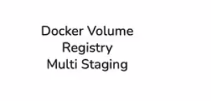
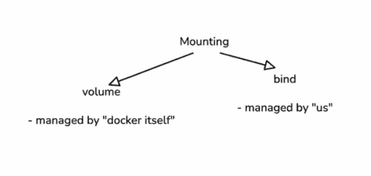
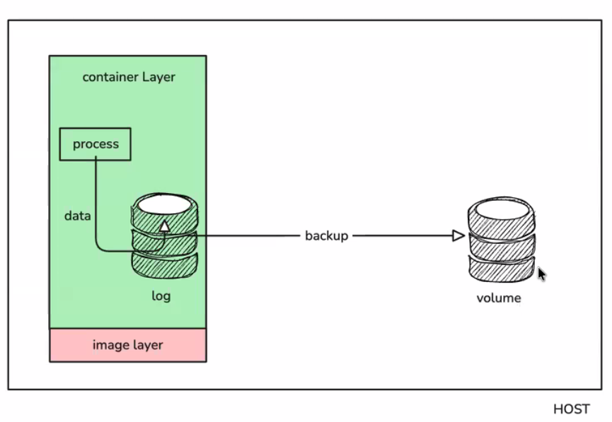
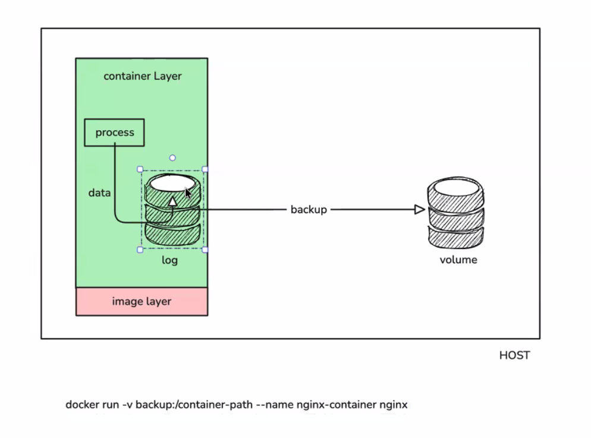
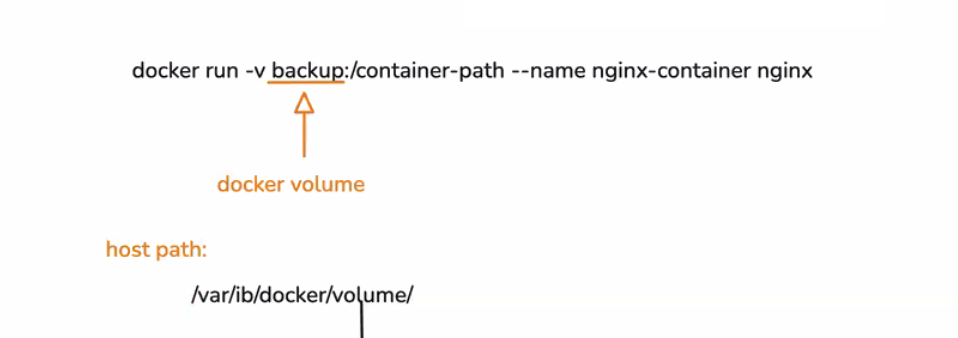
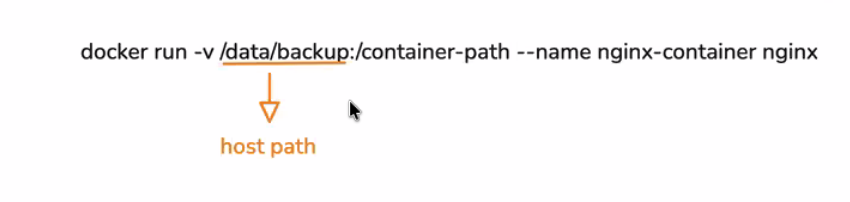
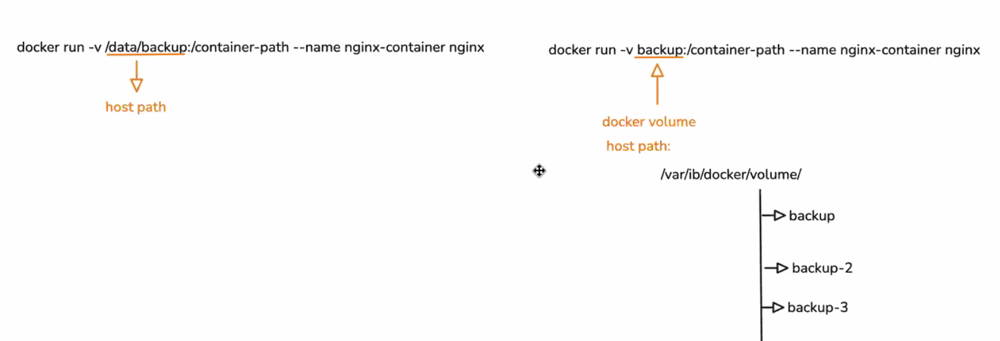
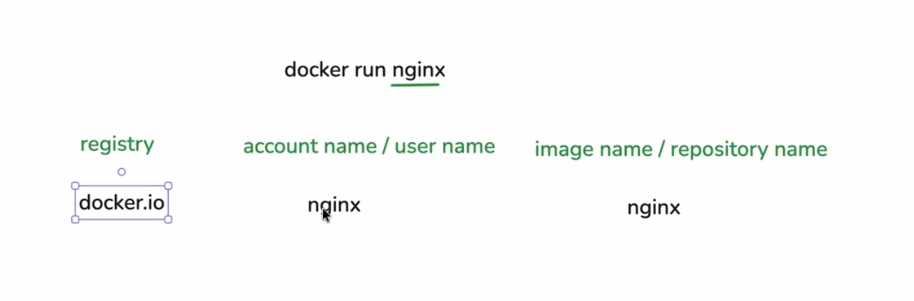

## Overview

This module covers three connected Docker topics:

1. Volumes and bind mounts for persistent data.
2. Image registries and image naming.
3. Multi-stage builds for smaller, safer production images.

## Why Volumes Matter

- A running container writes data into its writable container layer.
- That writable layer is not ideal for long-term persistence.
- If the container is removed, the data in that layer can be lost.
- Docker volumes store data outside the container filesystem, so data can outlive containers.

## Mounting Types

Docker commonly uses two mount styles:

- Volume mount: managed by Docker.
- Bind mount: managed by us (explicit host path).

Use volume mounts when you want Docker to manage storage. Use bind mounts when you need direct host-folder control.

## Volume Mount Example

The command shown maps a Docker volume named backup into a path inside the container.

- Left side of -v: backup (volume name)
- Right side of -v: /container-path (path inside container)

This is useful for logs, databases, uploads, and other stateful data.

### Interpreting backup:/container-path

- backup is a Docker volume, not a host folder path.
- Docker stores named volumes under its internal storage location on the host.
- On Linux, this is typically under /var/lib/docker/volumes/.

### Interpreting /data/backup:/container-path

- /data/backup is a host directory path.
- This is a bind mount.
- The host path must exist (or Docker may create it depending on options), and file ownership/permissions matter.

## Volume vs Bind Mount Quick Comparison

- Bind mount: direct host path mapping, great for local development and code sync.
- Volume: Docker-managed storage, cleaner for persistent app data in production.
- Named volumes are easier to move between containers and less tied to host directory structure.

# Registry

## Docker Image Name Resolution

When you run an image like nginx, Docker fills in defaults:

- Registry: docker.io
- Namespace/account: library (default official images namespace)
- Repository/image: nginx
- Tag (if omitted): latest

So nginx is resolved similarly to docker.io/library/nginx:latest.

# Multi-staging

## Multi-Stage Build Notes

- Stage 1 (build): includes compilers and full build dependencies.
- Stage 2 (deps/helper): can prepare intermediate artifacts or dependency layers.
- Stage 3 (runtime): copies only what is needed to run the app.

Benefits:

- Much smaller production image size.
- Fewer tools in runtime image, which improves security.
- Better caching and cleaner Dockerfiles.

Useful commands from the concept:

- Build a specific stage for debugging: docker build --target build .
- Build dependency stage only: docker build --target deps .
- Build final runnable image: docker build -t app:v1.2.3 .
