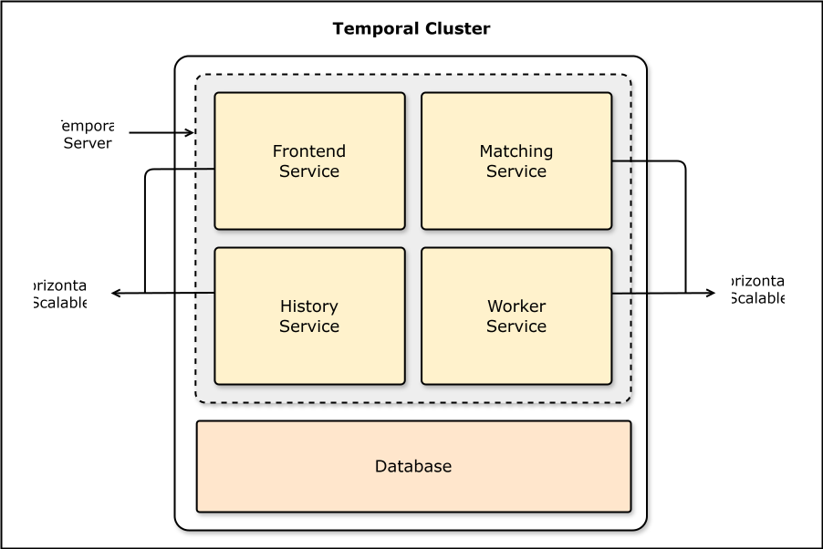
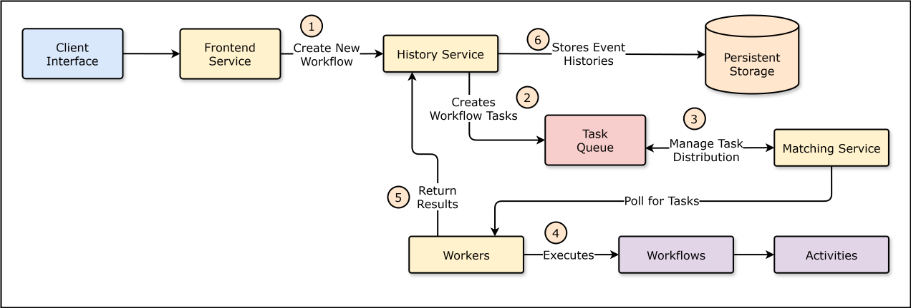
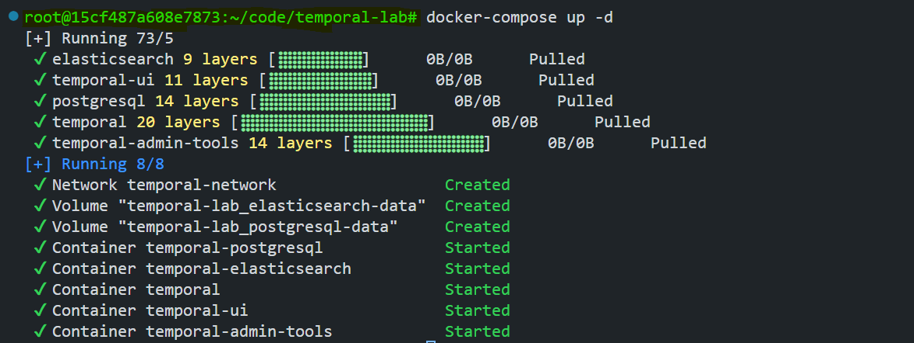
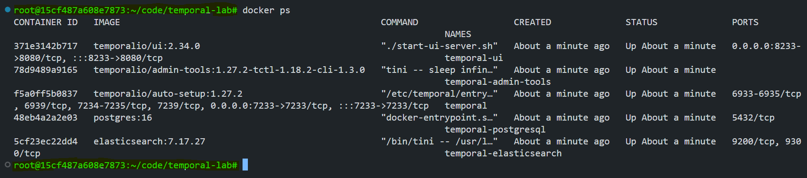
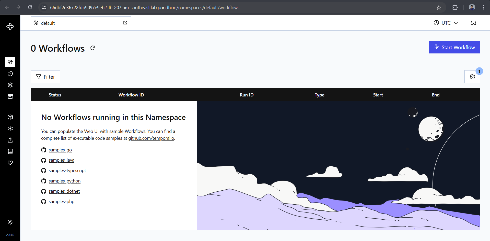
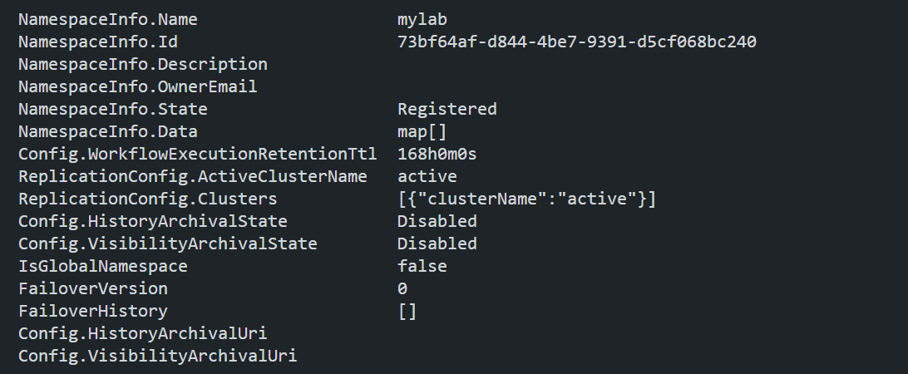
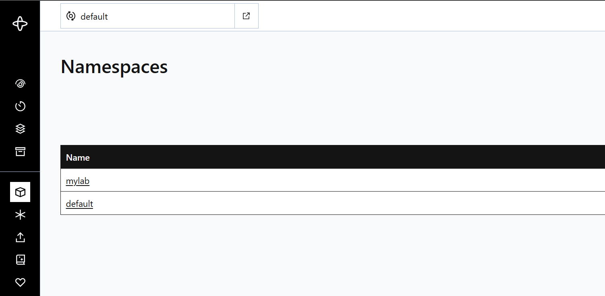
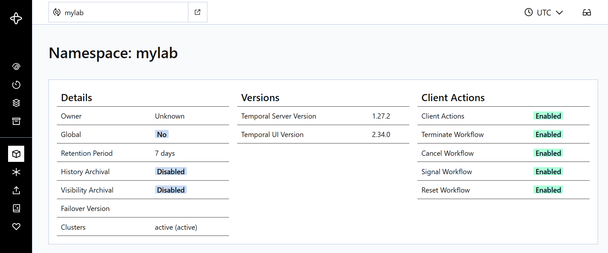

# Getting Started with Temporal - Setup and Exploration

Temporal is an open-source workflow orchestration platform for building reliable, long-running applications. It gives you a programming model for **Workflows** (business logic) and **Activities** (individual tasks) that are durable and fault-tolerant by construction: Temporal persists workflow state so execution survives crashes, deploys, and network failures instead of being lost with the process that ran it.

This lab sets up a local Temporal environment with Docker Compose, installs the Temporal CLI, and registers a namespace (`mylab`).

## Architecture



Temporal isn't one process, it's a small set of services that each own one job. A client never talks to "the database" directly, and a workflow never blocks waiting on a task queue by accident, the services below sit between them and coordinate everything:

- **Frontend Service**: the single entry point every client SDK and the CLI talk to. It accepts API calls like "start this workflow" or "signal this workflow," validates them, applies rate limiting, and routes each request to the right internal service. Nothing reaches History or Matching except through here.
- **History Service**: the source of truth for a workflow's state. Every event that happens in a workflow (started, activity scheduled, activity completed, timer fired, etc.) gets appended to that workflow's event history here. When a worker crashes and comes back, this is what lets the workflow replay its history and pick up exactly where it left off, instead of starting over.
- **Matching Service**: the dispatcher between pending work and idle workers. Workflow tasks and activity tasks sit in task queues; the Matching Service holds long-poll connections from workers and hands out tasks as they arrive, so work gets distributed to whichever worker is free rather than piling up on one.
- **Worker Service**: not part of the Temporal server itself, this is your application code. Workers long-poll the Matching Service for tasks, execute your workflow and activity code, and report results back through the Frontend Service. This is the only place your business logic actually runs.
- **Persistence Service**: the durability layer underneath History and Matching, backed by a real database (Cassandra, MySQL, or PostgreSQL in this lab). Every state transition the History Service records is written here first, which is what makes "durable execution" an actual guarantee instead of a marketing phrase.

## How It Works



- **Workflows** define the overall flow of the application, written in your language of choice via a Temporal SDK. A workflow specifies a sequence of steps and orchestrates activities. Temporal automatically persists workflow state, so a workflow can resume from its last known point after a failure instead of restarting from scratch.
- **Activities** are the individual tasks that make up a workflow, the actual units of work. They're typically short-lived and can run in parallel.
- **Workers** execute activities. They pull tasks from the Matching Service and run them, then report results back so the workflow can continue.

**Why this matters:**

- **Reliability**: workflows recover automatically from failure and resume where they left off.
- **Scalability**: thousands of concurrent workflows across distributed workers.
- **Simplicity**: retries, timeouts, and state management are handled by Temporal, not hand-rolled in application code.
- **Flexibility**: multi-language SDKs (Go, Java, Python, ...), pluggable persistence (PostgreSQL, MySQL, Cassandra) and visibility (Elasticsearch).

Typical use cases: microservices orchestration, financial transaction processing, CI/CD pipelines, background job scheduling.

## Step 1: Prepare the Docker Compose Environment

Create a project directory and the compose file:

```bash
mkdir temporal-lab
cd temporal-lab
```

Create `docker-compose.yml` (also saved at [`code/docker-compose.yml`](code/docker-compose.yml)):

```yaml
version: "3.5"
services:
  elasticsearch:
    container_name: temporal-elasticsearch
    environment:
      - cluster.routing.allocation.disk.threshold_enabled=true
      - cluster.routing.allocation.disk.watermark.low=512mb
      - cluster.routing.allocation.disk.watermark.high=256mb
      - cluster.routing.allocation.disk.watermark.flood_stage=128mb
      - discovery.type=single-node
      - ES_JAVA_OPTS=-Xms256m -Xmx256m
      - xpack.security.enabled=false
    image: elasticsearch:${ELASTICSEARCH_VERSION}
    networks:
      - temporal-network
    expose:
      - 9200
    volumes:
      - elasticsearch-data:/var/lib/elasticsearch/data
  postgresql:
    container_name: temporal-postgresql
    environment:
      - POSTGRES_PASSWORD=temporal
      - POSTGRES_USER=temporal
    image: postgres:${POSTGRESQL_VERSION}
    networks:
      - temporal-network
    expose:
      - 5432
    volumes:
      - postgresql-data:/var/lib/postgresql/data
  temporal:
    container_name: temporal
    depends_on:
      - postgresql
      - elasticsearch
    environment:
      - DB=postgres12
      - DB_PORT=5432
      - POSTGRES_USER=temporal
      - POSTGRES_PWD=temporal
      - POSTGRES_SEEDS=postgresql
      - DYNAMIC_CONFIG_FILE_PATH=config/dynamicconfig/development-sql.yaml
      - ENABLE_ES=true
      - ES_SEEDS=elasticsearch
      - ES_VERSION=v7
      - TEMPORAL_ADDRESS=temporal:7233
      - TEMPORAL_CLI_ADDRESS=temporal:7233
    image: temporalio/auto-setup:${TEMPORAL_VERSION}
    networks:
      - temporal-network
    ports:
      - 7233:7233
    volumes:
      - ./dynamicconfig:/etc/temporal/config/dynamicconfig
  temporal-admin-tools:
    container_name: temporal-admin-tools
    depends_on:
      - temporal
    environment:
      - TEMPORAL_ADDRESS=temporal:7233
      - TEMPORAL_CLI_ADDRESS=temporal:7233
    image: temporalio/admin-tools:${TEMPORAL_ADMINTOOLS_VERSION}
    networks:
      - temporal-network
    stdin_open: true
    tty: true
  temporal-ui:
    container_name: temporal-ui
    depends_on:
      - temporal
    environment:
      - TEMPORAL_ADDRESS=temporal:7233
      - TEMPORAL_CORS_ORIGINS=http://localhost:3000
    image: temporalio/ui:${TEMPORAL_UI_VERSION}
    networks:
      - temporal-network
    ports:
      - 8233:8080
networks:
  temporal-network:
    driver: bridge
    name: temporal-network
volumes:
  elasticsearch-data:
  postgresql-data:
```

It defines five services on a shared `temporal-network` bridge network:

- **elasticsearch**: the visibility store, used for querying workflow histories (e.g. filtering by status). Single-node, 256 MB JVM heap, security disabled for local dev, data persisted in the `elasticsearch-data` volume.
- **postgresql**: the persistence store backing workflow state durability. Runs with a `temporal`/`temporal` user/password, data persisted in the `postgresql-data` volume.
- **temporal**: the Temporal server itself (`temporalio/auto-setup`, which auto-configures the DB schema on first boot). Connects to Postgres and Elasticsearch, reads dynamic config from `./dynamicconfig/development-sql.yaml`, and exposes the client-facing gRPC port on `7233`.
- **temporal-admin-tools**: an interactive container with `tctl`/`temporal` CLI tooling preinstalled, wired to talk to the `temporal` service.
- **temporal-ui**: the Web UI, talks to `temporal:7233` internally and is published on `8233:8080` (so the UI is reached at `http://localhost:8233`).

## Step 2: Environment Variables and Dynamic Config

Create a `.env` file (also saved at [`code/.env`](code/.env)) to pin image versions for all the containers. This keeps `docker-compose.yml` generic and makes upgrades a one-line change:

```env
ELASTICSEARCH_VERSION=7.17.27
POSTGRESQL_VERSION=16
TEMPORAL_VERSION=1.27.2
TEMPORAL_ADMINTOOLS_VERSION=1.27.2-tctl-1.18.2-cli-1.3.0
TEMPORAL_UI_VERSION=2.34.0
```

Create the dynamic config directory and file:

```bash
mkdir dynamicconfig
echo "{}" > dynamicconfig/development-sql.yaml
```

This creates `dynamicconfig/development-sql.yaml` (also saved at [`code/dynamicconfig/development-sql.yaml`](code/dynamicconfig/development-sql.yaml)):

```json
{}
```

The `temporal` service mounts this file at `/etc/temporal/config/dynamicconfig` and reads it via `DYNAMIC_CONFIG_FILE_PATH`. It's where you'd tune rate limits, feature flags, visibility settings, or other runtime behavior without restarting the server. For this lab it's just an empty JSON object, a placeholder that satisfies the env var and leaves the server on default settings.

## Step 3: Start Temporal

```bash
docker-compose up -d
```

`-d` runs everything in detached mode. This brings up `elasticsearch`, `postgresql`, `temporal`, `temporal-admin-tools`, and `temporal-ui`.



Verify all containers are running:

```bash
docker ps
```



## Step 4: Access the Temporal Web UI

Once the containers are up, the UI is reachable directly at:

```text
http://localhost:8233
```



## Step 5: Install the Temporal CLI

```bash
curl -sSf https://temporal.download/cli.sh | sh
```

Add it to your `PATH` (append to `~/.bashrc` or `~/.zshrc`):

```bash
export PATH="$HOME/.temporalio/bin:$PATH"
```

Verify:

```bash
temporal --version
```

## Step 6: Register a Namespace

```bash
temporal operator namespace create --namespace mylab --retention 168h
```

`--retention 168h` sets a 7-day retention window for closed workflow history in this namespace.

Verify it's registered:

```bash
temporal operator namespace list
```



It also shows up in the Web UI:



And you can drill into its details (retention, config, etc.):



## Recap

At this point there's a working local Temporal cluster: PostgreSQL for durable workflow state, Elasticsearch for visibility/search, the Temporal server tying them together, and a registered `mylab` namespace reachable from both the CLI and the Web UI at `http://localhost:8233`. This is the base environment the next labs build workflows and activities on top of.
