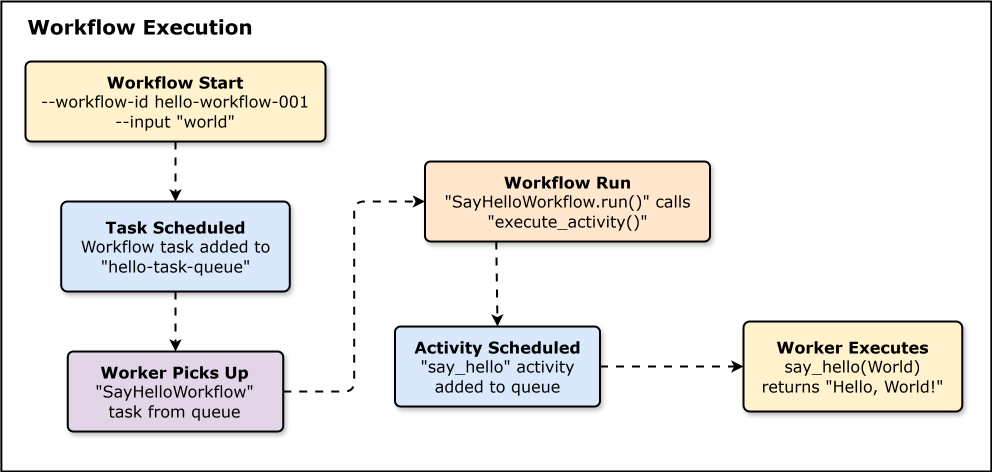
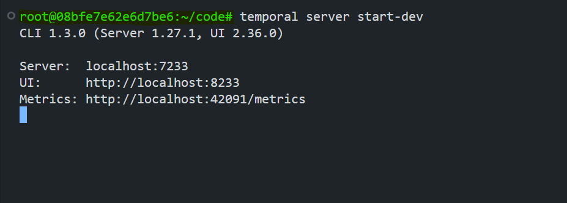
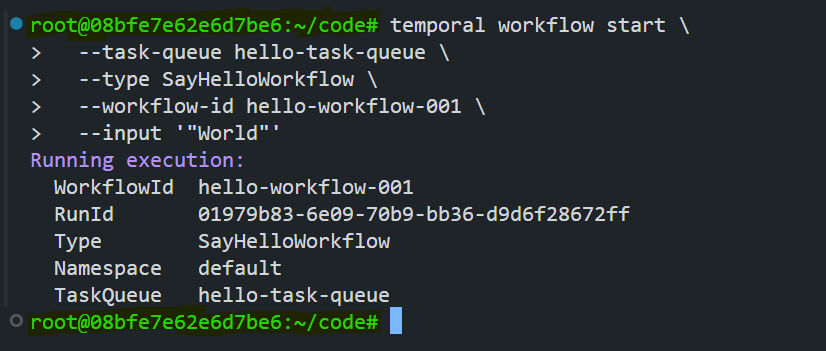
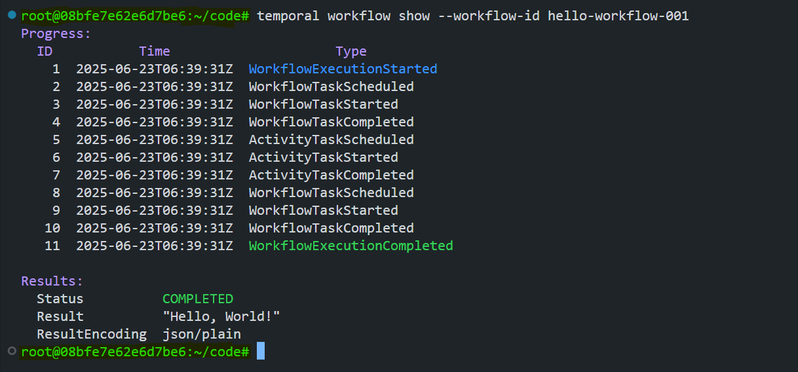
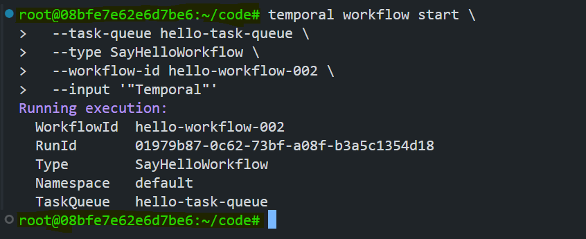

# Building Your First Temporal Workflow

This lab builds a "Hello World" workflow on the Go SDK: a workflow that calls a single activity, run by a worker, and started through the Temporal CLI. It's the first hands-on look at how the pieces from the previous lab (server, worker, task queue) actually cooperate to run real code.

## Core Concepts

- **Workflow**: the orchestration logic. Here, `SayHelloWorkflow` (in `hello_workflow.go`) does one thing: call the `SayHello` activity and return its result. Temporal persists the workflow's state as it runs, so if the worker dies mid-execution, the workflow doesn't lose progress, it resumes from its last recorded event instead of starting over.
- **Activity**: the actual unit of work. `SayHello` (in `hello_activity.go`) takes a name and returns a greeting string. Activities are where side effects and real logic live; the workflow calls them but doesn't do the work itself. Activities can have timeouts, this lab sets a 10-second `StartToCloseTimeout`, meaning the activity must finish within 10 seconds of starting or Temporal will fail it.
- **Worker**: the process that actually executes workflow and activity code. `worker.go` connects to the Temporal server, registers `SayHelloWorkflow` and `SayHello`, and polls a task queue for work. Without a running worker, a started workflow just sits scheduled with nothing to execute it.
- **Task Queue**: the named channel that connects a started workflow to a worker willing to run it. Both the worker and the `workflow start` command point at `hello-task-queue`, that's the only reason the worker picks up this particular workflow.

## Step 1: Install the Temporal CLI

```bash
curl -sSf https://temporal.download/cli.sh | sh
echo 'export PATH="$HOME/.temporalio/bin:$PATH"' >> ~/.bashrc
source ~/.bashrc
temporal --version
```

## Step 2: Verify Go Installation

```bash
go version
```

## Step 3: Create the Project and Install the SDK

```bash
mkdir temporal-hello-world
cd temporal-hello-world
go mod init hello-workflow
go get go.temporal.io/sdk
go mod tidy
```

## Step 4: Write the Workflow, Activity, and Worker

Three files, also saved under [`code/`](code/):

`hello_activity.go` (also at [`code/hello_activity.go`](code/hello_activity.go)):

```go
package main

import (
    "context"
    "fmt"
)

func SayHello(ctx context.Context, name string) (string, error) {
    return fmt.Sprintf("Hello, %s!", name), nil
}
```

`hello_workflow.go` (also at [`code/hello_workflow.go`](code/hello_workflow.go)):

```go
package main

import (
    "time"

    "go.temporal.io/sdk/workflow"
)

func SayHelloWorkflow(ctx workflow.Context, name string) (string, error) {
    ao := workflow.ActivityOptions{
        StartToCloseTimeout: 10 * time.Second,
    }
    ctx = workflow.WithActivityOptions(ctx, ao)

    var result string
    err := workflow.ExecuteActivity(ctx, SayHello, name).Get(ctx, &result)
    return result, err
}
```

`worker.go` (also at [`code/worker.go`](code/worker.go)):

```go
package main

import (
    "log"

    "go.temporal.io/sdk/client"
    "go.temporal.io/sdk/worker"
)

func main() {
    c, err := client.Dial(client.Options{
        HostPort: "localhost:7233",
    })
    if err != nil {
        log.Fatalln("Unable to create client", err)
    }
    defer c.Close()

    w := worker.New(c, "hello-task-queue", worker.Options{})
    w.RegisterWorkflow(SayHelloWorkflow)
    w.RegisterActivity(SayHello)

    log.Println("Worker starting...")
    err = w.Run(worker.InterruptCh())
    if err != nil {
        log.Fatalln("Unable to start worker", err)
    }
}
```

`worker.go` is the one that ties it together: it dials the server at `localhost:7233`, registers both the workflow and the activity by name, and blocks polling `hello-task-queue` until interrupted.

## Step 5: Start the Temporal Development Server

In its own terminal:

```bash
temporal server start-dev
```

`start-dev` spins up a self-contained Temporal server (no Docker Compose needed for this lab) with an in-memory database, and exposes the server on `7233`, the Web UI on `8233`, and metrics on `42091`. Leave this terminal running.



## Step 6: Start the Worker

In a second terminal, from `temporal-hello-world`:

```bash
go run .
```

Expected output:

```text
Worker starting...
```

Leave this terminal running too, this is the process that will actually execute the workflow once it's started.

## Step 7: Execute the Workflow

In a third terminal:

```bash
temporal workflow start \
  --task-queue hello-task-queue \
  --type SayHelloWorkflow \
  --workflow-id hello-workflow-001 \
  --input '"World"'
```

This asks the server to schedule `SayHelloWorkflow` on `hello-task-queue` with input `"World"`. The worker from Step 6 picks it up, runs the workflow, which calls the `SayHello` activity, and the activity returns `"Hello, World!"`.



## Step 8: Verify the Workflow Result

```bash
temporal workflow show --workflow-id hello-workflow-001
```

This prints the full event history (`WorkflowExecutionStarted` -> `ActivityTaskScheduled` -> `ActivityTaskCompleted` -> `WorkflowExecutionCompleted`) plus the final result: `"Hello, World!"`. This event list is exactly what the History Service persists, it's what lets the workflow recover mid-execution instead of just being "output logs."



## Step 9: Run Another Workflow with a Different Input

```bash
temporal workflow start \
  --task-queue hello-task-queue \
  --type SayHelloWorkflow \
  --workflow-id hello-workflow-002 \
  --input '"Temporal"'
```



```bash
temporal workflow show --workflow-id hello-workflow-002
```

Expected result: `"Hello, Temporal!"`. Same workflow and activity code, same worker, different `--workflow-id` and input, this is what makes the worker/task-queue model reusable instead of one-shot.

## Recap

The workflow and activity are just plain Go functions; what makes them "Temporal" is that a worker registers them against a task queue, and the server tracks every step as durable history. Two runs of `SayHelloWorkflow` with different inputs and different workflow IDs proved the same worker can serve unrelated workflow executions concurrently. Next step from here is workflows with more than one activity, retries, and signals.
